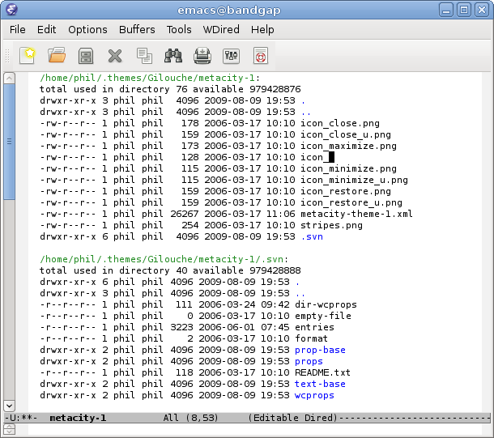

`M-x dired`在所选目录中启动 Dired 文件管理器模式。
然后按下 `C-x C-q`（或`M-x wdired-change-to-wdired-mode` ）切换到可编辑 Dired 模式：

`Close-up of a directory listing in Editable Dired mode.`

在这种模式下，更改右栏文件名，然后键入 `C-x C-s` （“保存”）即可实现指定文件的重命名。

重命名文件与编辑文本一样容易。

批量重命名（例如，重命名形如 `icon_*` 的文件为 `backup_icon_*` ）与执行查找和替换一样容易（`M-x query-replace` 或 `M-%` ），我们不需要学习如何使用一个单独的批量重命名工具。

在 Emacs 中，与我们进行交互的不仅包括文件和目录，还有系统工具、编译器、调试器、个人信息管理器、网页、电子邮件、聊天应用，以及其它各种互联网服务等，而且有一个第三方工具系统为我们提供更多的功能特性。正是由于这种整合性，Emacs 的优势得以体现：我们所学会的任意一项编辑功能（例如查找和替换），都可以在各种不同场景下得到应用。
